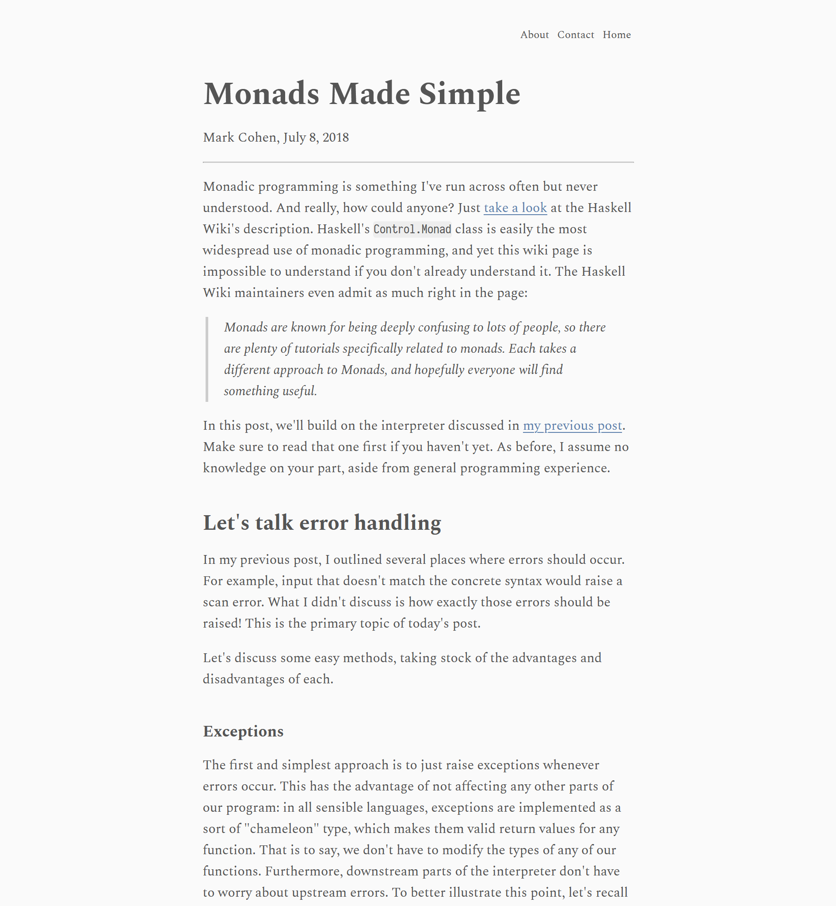
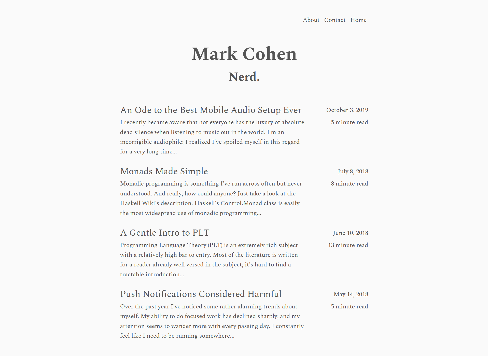

# eleventy-plugin-description

Eleventy plugin for generating fuzzily-fixed-length post excerpts.

## Installation
```bash
$ npm i eleventy-plugin-description
```

## Usage
In `.eleventy.js`:
```js
const description = require('eleventy-plugin-description');

module.exports = function(config) {
  config.addPlugin(description);
};
```

This plugin adds a filter called `description`, into which you can pipe template contents, like so:
```nunjucks

  <div class="summary">
    {{ post.templateContent | description }}
  </div>

```

The filter is engineered to give excerpts that are roughly uniform in length and never broken in awkward places.


## Behavior

Under the hood, this plugin first calls out to [`html-to-text`](https://www.npmjs.com/package/html-to-text) to convert the template contents from rendered HTML to plain text. By default, it strips all formatting, links, and images, but notably includes headings.

Once the HTML has been converted to plain text, the text is split by phrases, and then phrases are added to the excerpt until the length cutoff is reached. The default length cutoff is 200 characters, so excerpts will be 200 characters or a little more.

Finally, once the excerpt is built up, a terminator (`'...'` by default) is appended.

## Examples
Here's a post of mine: 

Here's my home page, where you can see its (and other posts') generated excerpt(s): 


## Overrides
In `.eleventy.js`, you can pass an object with overrides to `addPlugin` like so:
```js
config.addPlugin(description, {
  phraseRegex: /(\p{Sentence_Terminal}\p{White_Space})/gu
  lengthCutoff: 280
});
```

Here are all the possible overrides and a few notes on each.

### `htmlToTextOverrides`
Defaults:
```js
{
  wordwrap: false,
  ignoreHref: true,
  ignoreImage: true,
  uppercaseHeadings: false,
}
```

This is an object containing properties to be passed to the `html-to-text` plugin. [Here](https://www.npmjs.com/package/html-to-text#options) is a reference for all the options available for `html-to-text`. This object is spread over the default options, so they can be overridden as well.


### `phraseRegex`
Default: `/(\p{Terminal_Punctuation}\p{White_Space})/gu`

This property is a regex dictating how to split phrases up. The default regex uses two [Unicode property escapes](https://developer.mozilla.org/en-US/docs/Web/JavaScript/Guide/Regular_Expressions/Unicode_Property_Escapes) - [here](https://unicode.org/cldr/utility/list-unicodeset.jsp?a=[:Terminal_Punctuation=Yes:]) is a reference for `Terminal_Punctuation`, and [here](https://unicode.org/cldr/utility/list-unicodeset.jsp?a=[:White_Space=Yes:]) is a reference for `White_Space`. For plain English text, `Terminal_Punctuation` is equivalent to `[!,.:;?]`. Splitting on phrases instead of sentence boundaries tends to produce excerpts of a more uniform length, but you can really split on whatever you want. If you want sentence boundaries, try out `/(\p{Sentence_Terminal}\p{White_Space})/gu`.

**Warning! It's important that whatever regex you use, it's surrounded by parentheses. Otherwise, whatever punctuation you're matching on will be removed from the text (this is because of how [`String.prototype.split`](https://developer.mozilla.org/en-US/docs/Web/JavaScript/Reference/Global_Objects/String/split) works).**


### `lengthCutoff`
Default: `200`

This is a fuzzy maximum length. It's not a hard maximum - in particular, phrases will be appended to the excerpt until the cutoff is exceeded. In practice, it's usually best to just tweak the number up or down until it looks good.


### `terminator`
Default: `'...'`

This is just a string that gets appended to the end of each excerpt. To disable, just set it to the empty string (`''`).
